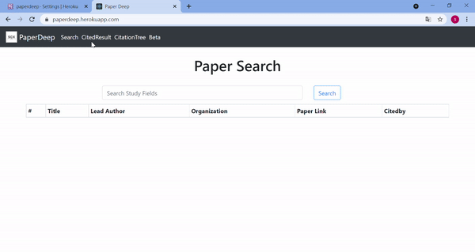

<!--
*** Thanks for checking out the Best-README-Template. If you have a suggestion
*** that would make this better, please fork the repo and create a pull request
*** or simply open an issue with the tag "enhancement".
*** Don't forget to give the project a star!
*** Thanks again! Now go create something AMAZING! :D
-->

<!-- PROJECT SHIELDS -->
<!--
*** I'm using markdown "reference style" links for readability.
*** Reference links are enclosed in brackets [ ] instead of parentheses ( ).
*** See the bottom of this document for the declaration of the reference variables
*** for contributors-url, forks-url, etc. This is an optional, concise syntax you may use.
*** https://www.markdownguide.org/basic-syntax/#reference-style-links
-->
[![Contributors][contributors-shield]][contributors-url]
[![Forks][forks-shield]][forks-url]
[![Stargazers][stars-shield]][stars-url]
[![Issues][issues-shield]][issues-url]

<!-- PROJECT LOGO -->
 

  

  <h3 align="center">SCK Team</h3>

  

    PaperDeep Project Repo
     
    <a href="/doc"><strong>Explore the docs »</strong></a>
     
     
    <a href="https://paperdeep.herokuapp.com/">View Demo</a>
    ·
    <a href="https://github.com/SOA-SCK/PaperDeep/issues">Report Bug</a>
    ·
    <a href="https://github.com/SOA-SCK/PaperDeep/issues">Request Feature</a>
  

# PaperDeep  
Application that advances researsh article searching and plays a role of literature review assistant for researchers, professionals, graduates and undergraduates.

<!-- TABLE OF CONTENTS -->

  
Table of Contents

  <ol>
    <li><a href="#live-demo">Live Demo</a></li>
    <li><a href="#overview">Overview</a></li>
    <li><a href="#domain-specific-words">Domain-Specific Words</a></li>
    <li><a href="#features">Features</a></li>
    <li><a href="#contributing">Contributing</a></li>
    <li><a href="#contact">Contact</a></li>
    <li><a href="#acknowledgments">Acknowledgments</a></li>
  </ol>

## Live Demo

## Overview
When researchers are drowning in enormous paper mess, they are afraid of omitting any papers relevant to their research topic. Even though Google Scholar, Scopus, Web of Science, etc. with a bunch of fancy and powerful features on their websites can be utilized, researchers still have one simple question: 

###  ***So, what are those most relevant papers that I need, and what is the relationship among previous works?***  

It is a long-standing issue and also an urgent need to build an application that provides precise searching result and categorizes correlated literatures. Therefore, PaperDeep advances paper search, constructs citation trees, provides publication cluster and recommends the most relevant and significant papers.

Paperdeep will pull data from Scopus API, based on user's keywords, to provide 

* Citation Tree

* Paper Cluster

* Publication Cluster

* Recommendation of Masterpiece

(<a href="#top">back to top</a>)

## Domain-Specific Words
* **Title**: title of the paper
* **eid**: paper id in scopus database
* **link**: the paper URL
* **publication name**: the publication of paper (Conference, Jornal)
* **date**: the publication date of paper
* **organization**: the organization of the author
* **citedby**: a citation count of the paper
* **author**: Lead authorname

(<a href="#top">back to top</a>)

## Features

- [x] Search paper via keyword
- [x] view all cited papers
- [x] Show the impact factor of the publication
- [ ] Clustering of papers
- [ ] Automatically recommend impactful papers according user’s study field
- [ ] For papers from at least one year ago, base on citations and web of science. Otherwise, base on Conference.
- [ ] Citation tree : a study path for novices in certain domain
- [ ] Booming paper: Track and report the citation growth of papers

See the [open issues](https://github.com/SOA-SCK/PaperDeep/issues) for a full list of proposed features (and known issues).

(<a href="#top">back to top</a>)

---
## Citation Tree
PaperDeep constructs a literature review map for researchers. This map can also become a study path for novices in a certain domain.

(<a href="#top">back to top</a>)

## Paper Cluster
Clusters of papers.
PaperDeep clusters highly relevant papers and then sorts these papers, according to significance metrics (e.g. citations, journal impact), for each user from various kinds of academic disciplines and backgrounds.

(<a href="#top">back to top</a>)

## Long-term Goals

### Publication Cluster
Searching result sorted by publication's journal impact and clustered by different field.

### Recommendation of Masterpiece
PaperDeep automatically recommends impactful papers according to user’s study field.

(<a href="#top">back to top</a>)

---

<!-- CONTRIBUTING -->
## Contributing

Contributions are what make the open source community such an amazing place to learn, inspire, and create. Any contributions you make are **greatly appreciated**.

If you have a suggestion that would make this better, please fork the repo and create a pull request. You can also simply open an issue with the tag "enhancement".
Don't forget to give the project a star! Thanks again!

1. Fork the Project
2. Create your Feature Branch (`git checkout -b feature/AmazingFeature`)
3. Commit your Changes (`git commit -m 'Add some AmazingFeature'`)
4. Push to the Branch (`git push origin feature/AmazingFeature`)
5. Open a Pull Request

(<a href="#top">back to top</a>)

<!-- CONTACT -->
## Contact

SOA-SCK Team - soa.sck@gmail.com

Project Link: [https://github.com/SOA-SCK/PaperDeep](https://github.com/SOA-SCK/PaperDeep)

(<a href="#top">back to top</a>)

<!-- ACKNOWLEDGMENTS -->
## Acknowledgments

* [othneildrew/Best-README-Template](https://github.com/othneildrew/Best-README-Template)
* [GitHub Emoji Cheat Sheet](https://www.webpagefx.com/tools/emoji-cheat-sheet)
* [Malven's Flexbox Cheatsheet](https://flexbox.malven.co/)
* [Malven's Grid Cheatsheet](https://grid.malven.co/)
* [Img Shields](https://shields.io)
* [GitHub Pages](https://pages.github.com)
* [Font Awesome](https://fontawesome.com)
* [React Icons](https://react-icons.github.io/react-icons/search)

(<a href="#top">back to top</a>)

<!-- MARKDOWN LINKS & IMAGES -->
<!-- https://www.markdownguide.org/basic-syntax/#reference-style-links -->
[contributors-shield]: https://img.shields.io/github/contributors/othneildrew/Best-README-Template.svg?style=for-the-badge
[contributors-url]: https://github.com/SOA-SCK/PaperDeep/graphs/contributors
[forks-shield]: https://img.shields.io/github/forks/othneildrew/Best-README-Template.svg?style=for-the-badge
[forks-url]: https://github.com/SOA-SCK/PaperDeep/network/members
[stars-shield]: https://img.shields.io/github/stars/othneildrew/Best-README-Template.svg?style=for-the-badge
[stars-url]: https://github.com/SOA-SCK/PaperDeep/stargazers
[issues-shield]: https://img.shields.io/github/issues/othneildrew/Best-README-Template.svg?style=for-the-badge
[issues-url]: https://github.com/SOA-SCK/PaperDeep/issues
[product-screenshot]: images/screenshot.png
